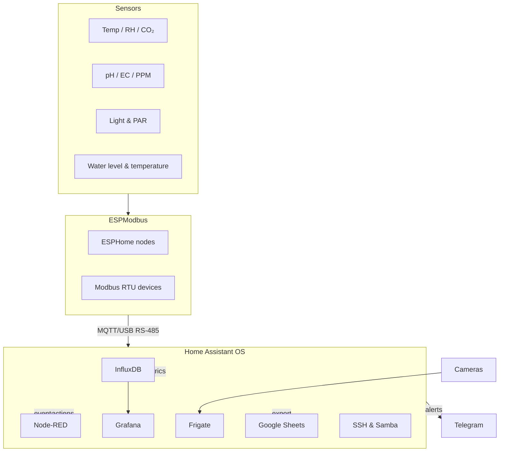

Hydroponics Farm on Home Assistant
About the project

This manual describes how to build a hydroponic farm on top of Home Assistant OS. The goal is to create a reproducible and extensible system that allows you to monitor, control and optimise your nutrient delivery, environmental conditions and yield. The farm will be run primarily on Home Assistant OS (HA OS) inside a VMware virtual machine, with all critical functions (pumps, circulation and safety shutdown) staying online even if the Home Assistant server goes down. This document provides a step‑by‑step guide to deploying the system and highlights trade‑offs, weak points and best practices.

High‑level architecture

The farm uses a mixture of ESPHome nodes and Modbus devices to read sensors (temperature, humidity, CO₂, pH, EC/PPM, water level) and drive actuators (pumps, valves, chillers, lights, fans). Data from these nodes flows into Home Assistant and is stored in InfluxDB with long‑term retention policies. Node‑RED runs complex automations (dosing, lighting, safe states). Grafana visualises long‑term trends. Frigate provides NVR and object detection for cameras. Optional Google Sheets integration exports selected metrics to Google Drive. Remote access is provided via dynamic DNS (DDNS) for monitoring and small adjustments.


Key goals

Full monitoring – log every sensor and actuator state at ~30 s intervals. Use InfluxDB to keep raw data for 12 months and downsampled 5‑minute aggregates for 36 months.

Flexible automation – write most logic in Node‑RED for clarity and maintainability; use native automations for simple triggers. Critical hardware (circulation pumps, aerators) stays running if the server fails.

Comprehensive dashboards – use Grafana for long‑term trends and Home Assistant dashboards for real‑time control; optionally export data to Google Sheets.

Safe operation – design safe states (all outputs off except circulation) and include redundant sensors. Use battery backup or UPS for pumps and controller.

Guide
1. Initial setup
1.1 Install Home Assistant OS in VMware

Download and decompress the HA OS VMDK – get the latest .vmdk image from the official download page. Unzip it if necessary.

Create a new virtual machine in VMware Workstation 17 (instructions based on the Home Assistant docs
home-assistant.io
):

Start VMware Workstation and select Create a New Virtual Machine.

Choose I will install the operating system later, then select Linux > Other Linux 5.x kernel 64‑bit
home-assistant.io
.

Name the VM (e.g. home-assistant) and choose a convenient folder (e.g. C:\home-assistant)
home-assistant.io
.

Allocate sufficient resources (≥ 4 GB RAM, ≥ 2 vCPUs and ≥ 32 GB disk). Select Store virtual disk as a single file.

Remove the CD/DVD device; it isn’t used
home-assistant.io
.

Under Network Adapter, select Bridged: Connected directly to the physical network. Disable “Replicate physical network connection state”
home-assistant.io
 and choose your main network adapter (Ethernet or Wi‑Fi)
home-assistant.io
.

Insert the HA OS disk – navigate to the VM folder, delete the placeholder VMDK file and copy the downloaded haos_ova_*.vmdk file into that folder, renaming it to home-assistant.vmdk
home-assistant.io
.

Edit the VMX file – open the VMX file in a text editor and add firmware = "efi" to enable UEFI boot
home-assistant.io
.

Start the VM – power on the VM. Once the HA OS boots, access it at http://homeassistant.local:8123 or via the VM’s IP address
home-assistant.io
.

Complete the onboarding – create an account and set your preferences.

Tip: If the VM fails to boot or you see a message about the .vmdk file, ensure you copied the extracted .vmdk (not the entire zip folder) and that UEFI is enabled
home-assistant.io
.

1.2 Networking and access

Bridged vs NAT – Bridged networking places HA OS in the same subnet as your Windows host, making it easier to access devices and services. Use the Bridged option in VMware and select your primary network adapter; uncheck “Replicate physical network connection state”
home-assistant.io
. NAT is simpler but isolates the VM behind the host’s IP, complicating device discovery.

Static IP configuration – by default HA OS uses DHCP
developers.home-assistant.io
. For predictable IP addresses (useful for MQTT, InfluxDB and firewall rules), either reserve the VM’s MAC address in your router or set a static IP in HA OS:

Using the UI: go to Settings > System > Network, select the interface and switch IPv4 method to “Static”. Enter IP, subnet mask and gateway based on your network.

Using nmcli (CLI) for advanced control
developers.home-assistant.io
:
```
ha > login
nmcli con edit "Home Assistant OS default"
nmcli> set ipv4.method manual
nmcli> set ipv4.addresses 192.168.1.50/24
nmcli> set ipv4.gateway 192.168.1.1
nmcli> set ipv4.dns "8.8.8.8 8.8.4.4"
nmcli> save
nmcli> quit
reboot
```

For USB or Wi‑Fi interfaces, supply SSID and PSK as shown in the developer docs
developers.home-assistant.io
.

SSH access – install the Terminal & SSH add‑on from Settings > Add‑ons. Enable Advanced Mode (Profile page) and install the add‑on
home-assistant.io
. Set a password or SSH keys in the Configuration tab and start the add‑on
home-assistant.io
. You can now connect via the web terminal or using an SSH client on port 22 (username: root). Note that the add‑on provides CLI access inside the HA container but does not expose the underlying host file system
home-assistant.io
.

Samba file sharing – install the Samba share add‑on from the Add‑on store. Define a username and password on the Configuration tab and save
home-assistant.io
. Start the add‑on and note the host name under Settings > System > Network
home-assistant.io
. From your PC, open \\your.ha.ip.address in File Explorer or smb://hostname in macOS/Linux to access the config, backup, media and other folders
home-assistant.io
.

2. Base add‑ons

The following sections describe installing and configuring the core add‑ons. Each subsection includes potential pitfalls and design choices.

2.1 Node‑RED (logic engine)

Installation – search for Node‑RED in the Add‑on store and install it. Provide a credential_secret (a strong password used to encrypt saved credentials) and start the add‑on
community.home-assistant.io
. The add‑on auto‑configures the connection to Home Assistant; no extra server settings are needed
community.home-assistant.io
. Open the web UI via the Open Web UI button
community.home-assistant.io
.

Configuration and pitfalls

Flows & security – Node‑RED runs in its own container. All flows are stored under /config/node-red. Keep flows modular: group repeating patterns into subflows and use Home Assistant’s global context to store persistent variables (e.g. last dosing time) instead of Node‑RED globals, which reset on restart. Avoid infinite loops by using delay or rbe (report by exception) nodes.

Credential_secret – forgetting your secret locks you out of flows; store it securely. Changing it after creating flows invalidates existing credentials.

Performance – heavy flows with tight loops can consume CPU and cause high latency in HA. Monitor the add‑on logs and system usage; break complex computations into slower, timed loops.

Choice justification – Node‑RED provides a visual drag‑and‑drop environment perfect for complex dosing logic, pump cycles and “if/then” rules. It is more maintainable than long YAML automations but adds another layer to learn. Keep simple automations in the native HA automation engine for reliability.

2.2 ESPHome (device builder)

Installation – install the ESPHome add‑on (Device Builder). After installation, start the add‑on and open the web UI. Use the wizard to create a new device: specify a name and Wi‑Fi credentials, then compile and install the firmware
esphome.io
. The first flash is usually done via USB; subsequent updates happen over Wi‑Fi.

Configuration and pitfalls

Initial flash – the first installation can be challenging. You must connect the microcontroller via USB and either mount it to HA OS (USB passthrough in VMware) or use ESPHome Web on your PC to flash the binary. Ensure the VM’s USB controller is set to USB 3.0 and the device is connected.

Wi‑Fi credentials – if you skip adding Wi‑Fi details, the device will not connect; you will need to re‑flash. Save your YAML configuration in the /config/esphome directory for version control
esphome.io
.

Logs and troubleshooting – use the Logs button in ESPHome to see real‑time output. The add‑on stores build files; if you run into compile errors, try Clean Build Files from the menu
esphome.io
.

Accessing files – to manually edit YAML files or view build artifacts, use the SSH add‑on or Samba. ESPHome runs in a container, so you must access it via /config/esphome
esphome.io
.

Choice justification – ESPHome allows you to write declarative YAML configuration for sensors and actuators. It integrates seamlessly with HA and supports OTA updates. Compared to DIY Arduino/MQTT code it saves time and ensures integration with the Supervisor.

2.3 InfluxDB (time‑series store)

Installation – install the InfluxDB add‑on from the Add‑on store. Choose version 1.x or 2.x; version 2 adds tokens and buckets but is more complex. After starting the add‑on, create a database (home_assistant) and user. The HA InfluxDB integration transfers state changes to the database
home-assistant.io
. Add the following to configuration.yaml to enable the integration:
```
influxdb:
  api_version: 1
  host: 127.0.0.1
  port: 8086
  database: home_assistant
  username: ha_user
  password: your_password
  max_retries: 3
  default_measurement: state
```

Start HA and the integration will appear under Settings > Devices & Services
home-assistant.io
. Note: for InfluxDB 2.x you need a token, organisation and bucket instead of username/password
home-assistant.io
.

Retention policies & downsampling

Create a retention policy (RP) for raw data, for example 52 weeks (12 months) and a second RP for aggregated data (36 months). In InfluxDB 1.x:
```
CREATE RETENTION POLICY "raw_12m" ON home_assistant DURATION 52w REPLICATION 1 DEFAULT;
CREATE RETENTION POLICY "hydro_5m" ON home_assistant DURATION 156w REPLICATION 1;

-- downsample to 5‑minute averages of numeric fields
CREATE CONTINUOUS QUERY cq_hydro_5m ON home_assistant
BEGIN
  SELECT mean(*) INTO home_assistant.hydro_5m.:MEASUREMENT FROM /.*/ GROUP BY time(5m), *
END;
```

This approach keeps high‑resolution data for one year and stores 5‑minute aggregates for three years
docs.influxdata.com
. In InfluxDB 2.x, similar functionality is achieved using tasks (Flux) instead of continuous queries.

Monitor database size: frequent writes (every 30 s) can fill the disk quickly. Use a dedicated virtual disk and allocate enough space. InfluxDB runs parallel to the internal HA database and does not replace it
home-assistant.io
.

Authentication: by default InfluxDB has no authentication. Always create users and passwords
home-assistant.io
, and enable SSL if the database is accessed over the network
home-assistant.io
.

Choice justification – InfluxDB is optimised for time‑series data. It supports retention policies and continuous queries, making it suitable for long‑term storage and downsampling. Alternative databases (TimescaleDB, VictoriaMetrics) exist but have less out‑of‑the‑box integration with Home Assistant.

2.4 Grafana (visualisation)

Installation – search for Grafana in the Add‑on store, install and start it. The default admin user has password hassio; change it immediately on first login
community.home-assistant.io
. Open the web UI and log in.

Configuration and pitfalls

Add InfluxDB data source – in Grafana, navigate to Configuration > Data Sources, add a new InfluxDB source and point it to your InfluxDB add‑on (http://a0d7b954-influxdb:8086). For InfluxDB 1.x, specify the database and RP (e.g. home_assistant, raw_12m or hydro_5m). For 2.x, use your bucket and token.

Create dashboards – build panels for each sensor (pH, EC, temperature, humidity, CO₂, water level). Use the 5‑minute RP for overview dashboards and the raw RP for detail. Avoid queries over huge time ranges; use time range shortcuts.

Security – restrict anonymous access and consider enabling Grafana’s authentication (OAuth, local users). Change the default password and update it regularly.

Choice justification – Grafana offers advanced visualisation and alerting features beyond the built‑in HA dashboards. It is optional, but extremely useful for trend analysis and correlation. The add‑on makes installation straightforward
community.home-assistant.io
.

2.5 Frigate NVR (camera integration)

Frigate provides real‑time object detection and recording for IP cameras. It runs as a separate container or add‑on and integrates with Home Assistant via MQTT.

Installation (add‑on) – the Frigate add‑on is available from community repositories. Prepare the system as follows
docs.frigate.video
:

Install an MQTT broker (e.g. the Mosquitto broker add‑on). Configure a username and password.

Add Frigate from the Community Add‑on repository. Configure at least one camera and specify MQTT credentials in config.yml (Frigate’s configuration file). Enable media_source in your configuration.yaml so that media clips appear in HA
docs.frigate.video
.

Restart Home Assistant and add the Frigate integration via Settings > Devices & Services > Add Integration > Frigate
docs.frigate.video
. Provide the URL of your Frigate instance, typically http://<host>:5000 for unauthenticated access or port 8971 for authenticated access
docs.frigate.video
.

Configuration and pitfalls

Hardware acceleration – Frigate relies on hardware decoding; passing through a USB Coral TPU or using GPU acceleration reduces CPU load. If hardware acceleration is unavailable, limit frame rates and resolution to avoid saturating the VM.

Storage – define a dedicated volume for recordings. Avoid storing long recordings inside the HA VM; mount a shared folder (e.g. via Samba) for media storage.

MQTT topics – Frigate publishes events to MQTT; ensure topic prefixes do not collide with other devices. Use Node‑RED or HA automations to trigger actions (e.g. turn on lights when motion detected).

Choice justification – Frigate’s integration with HA and its ability to perform local person/vehicle detection make it ideal for monitoring plant growth (time‑lapse) and security. However, it is resource intensive. For simple live viewing, the built‑in camera integration may suffice.

2.6 Google Sheets integration

The Google Sheets integration allows you to append data to a document in your Google Drive. This is useful for external reporting, backups or integration with other tools.

Prerequisites – you need to create OAuth credentials in Google Cloud and enable the Drive and Sheets APIs
home-assistant.io
. If you do not have credentials, follow the steps under “Scenario 2” in the official docs
home-assistant.io
:

Create a new project in the Google Developers Console and enable the Google Drive API and Google Sheets API
home-assistant.io
.

Under APIs & Services > OAuth consent screen, set the app name, support email and publish the app
home-assistant.io
.

Create OAuth Client ID credentials of type “Web Application”, adding https://my.home-assistant.io/redirect/oauth as an authorised redirect URI
home-assistant.io
. Note down the Client ID and Client Secret
home-assistant.io
.

Integration setup – in Home Assistant, go to Settings > Devices & Services > Add Integration and search for Google Sheets
home-assistant.io
. Enter the Client ID and Client Secret, follow the OAuth flow to log into your Google account and authorise the app
home-assistant.io
. HA will create a spreadsheet called “Home Assistant” in your Google Drive
home-assistant.io
.

Usage and pitfalls

Use the google_sheets.append_sheet service to add rows. Example automation in Node‑RED: call this service with a JSON payload containing the data (e.g. timestamp, pH, EC). The integration supports one spreadsheet and multiple worksheets
home-assistant.io
. Write operations count against Google API quotas; batching data or sampling at longer intervals reduces API usage.

Credentials may expire or become invalid if the OAuth consent screen is not published; ensure you publish the app when prompted【268927464315909†L87-L87】.

The integration only has access to the sheet created at setup
home-assistant.io
. If you need more complex exports, consider using Node‑RED to call the Google Sheets API directly or use n8n.

Choice justification – exporting to Google Sheets is useful for sharing data with non‑technical stakeholders and performing custom analytics. It should be used sparingly due to API limits; InfluxDB remains the primary store.

2.7 Mosquitto broker (recommended)

Although not explicitly requested, a local MQTT broker is essential for ESPHome nodes, Modbus bridges and Frigate. Install the Mosquitto broker add‑on, define a username and password and set anonymous: false. After starting the add‑on, add the MQTT integration via Settings > Devices & Services > Add Integration > MQTT, using the host localhost and credentials. This broker will be used by ESPHome (for states), Node‑RED and Frigate.

3. Subsequent configuration & best practices
3.1 Build robust automations

Use Node‑RED for complex logic: implement dosing routines, circulation schedules and error handling. Employ stoptimer nodes to enforce minimum intervals between nutrient dosing and rbe nodes to avoid repeated actions. Use HA helpers (input_number, input_boolean, schedule) to expose setpoints and modes on the dashboard.

Keep native automations for simple triggers (e.g. send Telegram alert when pH outside range, toggle safe state if water level too low). Native automations load faster and remain functional even if Node‑RED is restarted.

Implement a safe state: if HA stops responding, critical devices (circulation pump, aeration, lights) should continue running via hardware timers or independent controllers. Node‑RED can monitor HA’s own heartbeat and issue a safe‑state command when it stops updating.

Test automations individually before combining them. Use Debug nodes and persistent helpers to trace values.

3.2 Sensor calibration and redundancy

Calibration – follow manufacturer instructions to calibrate pH and EC probes regularly. Use helpers to store calibration constants and create Node‑RED flows to trigger calibration reminders.

Redundancy – install duplicate pH, EC and water‑level sensors in critical tanks. In Node‑RED, compare readings and flag discrepancies; choose the median value or fail to safe state.

Maintenance – schedule cleaning of pumps, filters and sensors. Use automations to log runtime hours and send reminders.

3.3 Dashboards & alerts

In Home Assistant, build a dashboard with cards for each section: nutrient tank (pH, EC, temperature), grow room environment (air temp, humidity, CO₂, light intensity), pump status and setpoints. Use vertical stacks and graphs for real‑time data.

In Grafana, create dashboards with panels for each sensor, using both raw and 5‑minute data. Save dashboards and reuse them as templates for new sections.

Use Frigate to produce time‑lapse videos: set up snapshots at regular intervals (e.g. every 30 minutes) and combine them externally. Node‑RED can trigger a script on your NAS to assemble images into a video.

Configure Telegram notifications for out‑of‑range conditions and system alerts. Use Node‑RED or native automations to send messages (e.g. pH high/low, pump failure, water level critical). Include relevant values in the messages.

3.4 Backups & maintenance

Install the Google Drive Backup add‑on (if not already) to automatically back up HA and add‑ons. Configure daily or weekly backups and keep at least the last 3 copies. Validate backups periodically.

Update HA OS, Supervisor and add‑ons separately. Make a backup before updates. Check release notes for breaking changes.

Monitor resource usage (CPU, RAM, disk) via the Supervisor. Increase VM resources or prune old InfluxDB data if you approach limits.

Conclusion

This manual provides a comprehensive roadmap for building an automated hydroponics farm on Home Assistant OS. By following the steps above, you will set up a stable virtual environment with flexible automations, rich visualisation and safe operation. Use the cited official documentation for deeper detail and stay current with Home Assistant releases.
