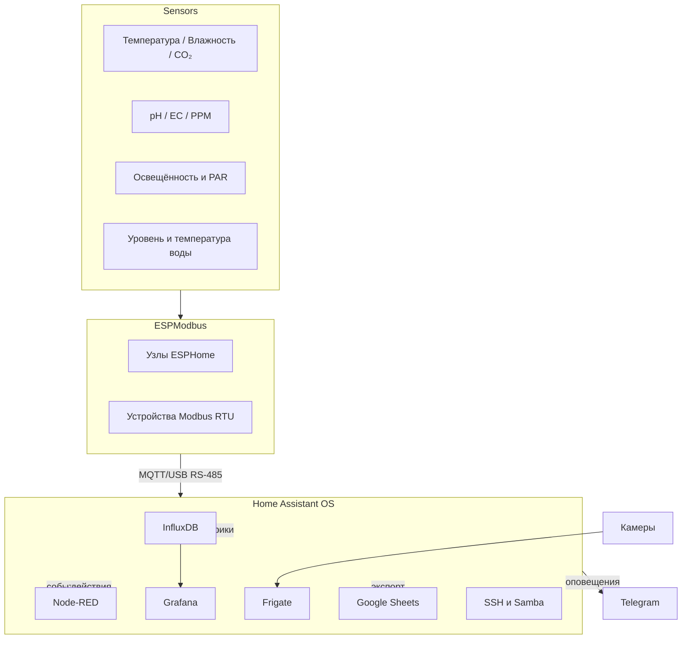

# Гидропонная ферма на Home Assistant

## О проекте

Это руководство описывает, как построить гидропонную ферму на базе Home Assistant OS. Цель — создать **воспроизводимую и расширяемую систему**, которая позволяет контролировать подачу питательных веществ, условия окружающей среды и урожайность. Ферма работает на **Home Assistant OS** (HA OS) в виртуальной машине VMware, при этом все критические функции (насосы, циркуляция, аварийное отключение) продолжают работать даже при сбое сервера Home Assistant. В документе приведено пошаговое руководство по развертыванию системы, а также указаны компромиссы, слабые места и лучшие практики.

### Общая архитектура

Ферма использует комбинацию узлов **ESPHome** и устройств **Modbus** для считывания данных с датчиков (температура, влажность, CO₂, pH, EC/PPM, уровень воды) и управления исполнительными механизмами (насосы, клапаны, охладители, освещение, вентиляторы). Данные поступают в Home Assistant и сохраняются в **InfluxDB** с политиками долговременного хранения. **Node‑RED** управляет сложными автоматизациями (дозирование, освещение, аварийные состояния). **Grafana** визуализирует долгосрочные тенденции. **Frigate** обеспечивает видеонаблюдение и детекцию объектов. Необязательная интеграция с **Google Sheets** позволяет экспортировать отдельные метрики в Google Drive. Удаленный доступ реализован через динамический DNS (DDNS) для мониторинга и мелких корректировок.



### Основные цели

- **Полный мониторинг** – журналировать все состояния датчиков и исполнительных устройств каждые \~30 секунд. Использовать InfluxDB для хранения необработанных данных 12 месяцев и агрегатов с шагом 5 минут — 36 месяцев.
- **Гибкая автоматизация** – реализовать логику в Node‑RED для наглядности и поддержки; простые триггеры — средствами Home Assistant. Критические устройства (насосы циркуляции, аэраторы) продолжают работать при сбое сервера.
- **Информативные панели** – Grafana для долгосрочной аналитики и панели Home Assistant для оперативного управления; опционально экспорт данных в Google Sheets.
- **Безопасная работа** – проектировать безопасные состояния (все выходы выключены, кроме циркуляции), использовать дублирующие датчики. Обеспечить резервное питание (UPS) для насосов и контроллера.

## Руководство

### 1. Начальная настройка

#### 1.1 Установка Home Assistant OS в VMware

1. **Скачать и распаковать образ HA OS VMDK** – загрузите актуальный `.vmdk` с официальной страницы. Распакуйте при необходимости.
2. **Создать виртуальную машину** в VMware Workstation 17 (инструкции по документации Home Assistant):
   - Запустите VMware и выберите **Create a New Virtual Machine**.
   - Укажите **I will install the operating system later**, затем выберите **Linux > Other Linux 5.x kernel 64‑bit**.
   - Назовите виртуальную машину (например, `home-assistant`) и выберите удобную папку (`C:\home-assistant`).
   - Выделите ≥ 4 ГБ ОЗУ, ≥ 2 vCPU и ≥ 32 ГБ диска. Опция: **Store virtual disk as a single file**.
   - **Удалите CD/DVD** устройство.
   - В разделе **Network Adapter** выберите **Bridged: Connected directly to the physical network** и снимите «Replicate physical network connection state».
3. **Подключить диск HA OS** – замените placeholder-файл `.vmdk` в папке ВМ на скачанный образ и переименуйте его в `home-assistant.vmdk`.
4. **Редактировать VMX** – добавьте строку `firmware = "efi"` для включения UEFI.
5. **Запустить ВМ** – откройте `http://homeassistant.local:8123` или используйте IP машины.
6. **Завершите настройку** – создайте аккаунт и установите предпочтения.

**Совет:** если ВМ не загружается, убедитесь, что скопирован именно файл `.vmdk`, а не zip-архив, и активирован UEFI.

#### 1.2 Сеть и доступ

1. **Bridged vs NAT** – режим Bridge помещает HA OS в ту же подсеть, что и ваш ПК, облегчая доступ к устройствам. NAT проще, но изолирует систему.
2. **Статический IP** – по умолчанию используется DHCP. Для стабильности задайте статический IP через интерфейс HA или `nmcli`.
3. **SSH-доступ** – установите аддон **Terminal & SSH**, включите Advanced Mode, задайте пароль или ключи и подключайтесь через порт 22.
4. **Samba-шары** – установите аддон **Samba share**, задайте логин и пароль, после чего сможете подключаться к каталогам `config`, `backup`, `media` с ПК.

### 2. Основные аддоны

#### 2.1 Node‑RED (логический движок)

**Установка** – установите аддон Node‑RED, задайте `credential_secret`, запустите и откройте веб-интерфейс. Подключение к Home Assistant выполняется автоматически.

**Рекомендации:**

- Храните потоки в `/config/node-red`, группируйте повторяющиеся шаблоны в subflows.
- Используйте `delay` и `rbe` для предотвращения циклов.
- Секрет храните безопасно — при утере потребуется пересоздание потоков.
- Node‑RED подходит для сложной логики (дозирование, циклы насосов и т.п.), простые сценарии лучше реализовывать в автоматизациях HA.

#### 2.2 ESPHome (устройства)

**Установка** – установите аддон ESPHome, создайте новое устройство, укажите имя и Wi‑Fi, затем прошейте контроллер. Первичная прошивка — по USB, далее OTA.

**Рекомендации:**

- При первой установке убедитесь, что ВМ поддерживает USB 3.0.
- YAML‑файлы сохраняйте в `/config/esphome` для контроля версий.
- Для отладки используйте кнопку **Logs**, при ошибках сборки выполните **Clean Build Files**.

#### 2.3 InfluxDB (временные ряды)

**Установка** – установите аддон InfluxDB. Создайте базу `home_assistant` и пользователя. В `configuration.yaml` добавьте:

```yaml
influxdb:
  api_version: 1
  host: 127.0.0.1
  port: 8086
  database: home_assistant
  username: ha_user
  password: your_password
  max_retries: 3
  default_measurement: state
```

**Политики хранения:**

Создайте retention policy (RP) для сырых данных (12 мес.) и агрегатов (36 мес.):

```sql
CREATE RETENTION POLICY "raw_12m" ON home_assistant DURATION 52w REPLICATION 1 DEFAULT;
CREATE RETENTION POLICY "hydro_5m" ON home_assistant DURATION 156w REPLICATION 1;

-- агрегация по 5 минут
CREATE CONTINUOUS QUERY cq_hydro_5m ON home_assistant
BEGIN
  SELECT mean(*) INTO home_assistant.hydro_5m.:MEASUREMENT FROM /.*/ GROUP BY time(5m), *
END;
```

Такой подход сохраняет детальные данные за год и 5‑минутные усреднения за три года.


